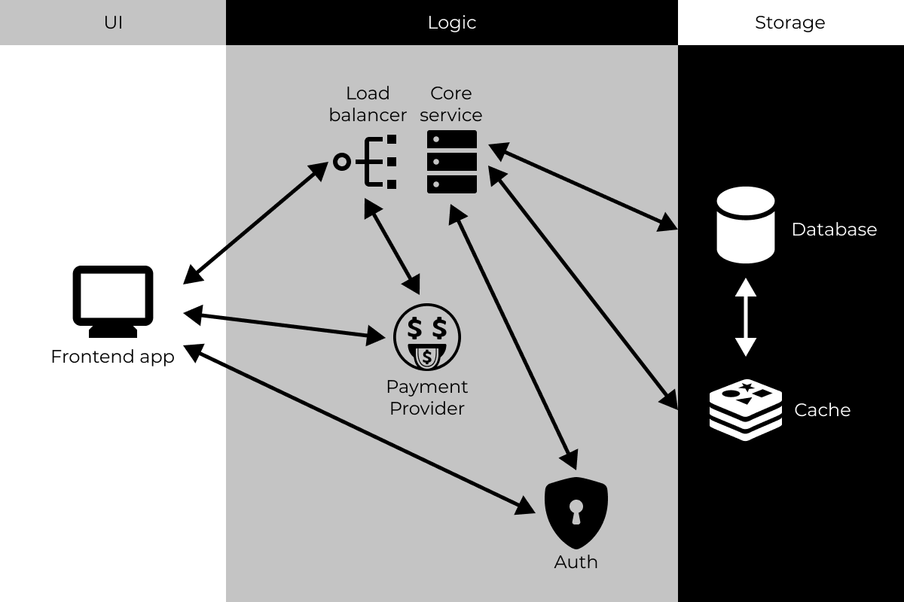
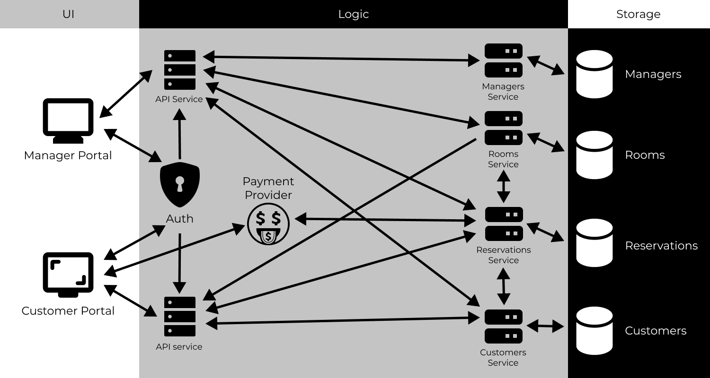

# Software Architecture (SA) for Hotel Reservation System (HRS)

## 1 Overview

### 1.1 System Overview

Hotel Reservation System (HRS) is a software system that is intended to help the hotel staff and managers to keep account of the rooms and reservations.

### 1.2 System Context

The system context is defined clearly in the SRS. Basically, the manager and the customer generate and consume data. The manager consumes data that is generated by the customer. The customer consumes data that is generated by the manager and the system.

### 1.3 Stakeholders of HMS

The main stakeholders for the system are the hotel staff (manager) and the customer. The main concerns of the two stakeholders are:

- Manager is responsible for the creation of the rooms and maintaining them.
- The customer is responsible for the reservation of the rooms.

### 1.4 Scope of this Document

In this document, we describe two possible architectures for HMS, compare them for
various quality attributes, and then choose the most appropriate one, which is our final proposed architecture for PIMS. By discussing the two alternatives, we also provide the rationale for selecting the final architecture. For architecture, we consider only the component and connector view.

### 1.5 Definitions and Acronyms

#### Acronyms and Abbreviations

- HRS: Hotel Reservation System
- SRS: Software Requirement Specification
- WebApp: Web Application

#### Definitions

- Dashboard: A web application that provides a dashboardfor the hotel staff and
managers.
- Customer: A user of the hotel.
- Hotel Manager (Manager): A person who manages everythingin the hotel

## Architecture Design

### 2.1 Architecture 1: The Monolithic Architecture Model

### 2.2 Architecture 2: The Microservices Architecture Model

### 2.3 Comparison of the two architectures

Here we compare the architectures with respect to various quality attributes.

| Criteria | Monolithic | Microservices |
| -------- | ------------- | ------------- |
| Quality | Good | Great |
| Complexity | Low | High |
| Scalability | Low | High |
| Security | Low | High |
| Reliability | Low | High |
| Maintainability | Low | High |
| Portability | High | Low |
| Ease of Installation | Easy | Difficult |

## Final Architecture of HMS

